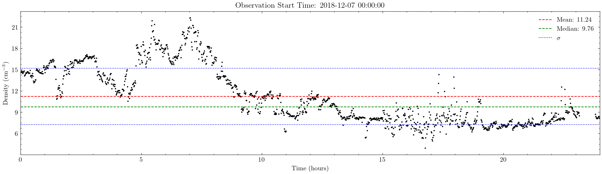

# Solar Density Querying (SDQ)

A collection of scripts for the semi-autonomous acquisition of data from the NOAA's Deep Space Climate Observatory (DSCOVR) and NASA's Advanced Composition Explorer (ACE). These scripts are intended for comparing real data against modeled data from pulsar emissions emanating through solar winds when in close conjunction with the Sun. ☀️
---

